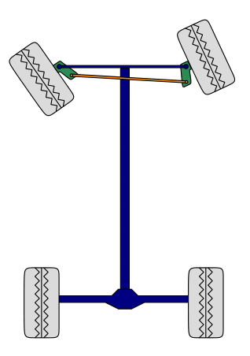
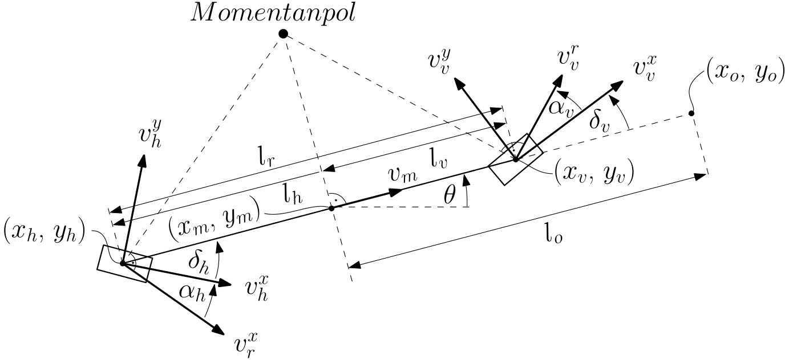

# Pathcontrol

## Modeling 
In this section the kinematic models of different types of steering concepts will be presented:

| Steering Type 	| Sketch 	
|---------------	|--------	
|    Ackermann-steering           	| {:style="height:150px"}        	
|       Allwheel steering        	| {:style="height:150px"}      
|       Skid steering        	| {:style="height:150px"}        	
|       Articulated steering        	| {:style="height:150px"}        

All models will be presented with an offset control point in the longitudinal axle and with the length $l_o$ as well as with side slip angles $\alpha_f$, $\alpha_r$ or $\alpha_m$.

### Ackermann-steering: Kinematic model
* Sketch of the Ackermann-steering as a single-track model:

{:style="height:350px"}

* Ordinary differential equation(ODE):

\begin{align}
   \dot x_o &=  \frac{d}{dt} \bigl(x_m + l_o \cos\theta  \bigl) =  v_m \cos\theta -  \dot\theta l_o \sin\theta \\
   \dot y_o &= \frac{d}{dt}  \bigl(y_m + l_o \sin\theta  \bigl) = v_m \sin\theta +  \dot\theta l_o \cos\theta  \\
    \dot \theta &= \frac{v_r^x}{l_w} {\cos{\alpha_h}} \bigl(\tan(\delta_f+\alpha_f) - \tan(\alpha_r)\bigl)
\end{align}

* Relationship of the distance from the rear to the front axle:
\begin{align}
   l_r = l_f \frac{\tan(\alpha_r)}{\tan(\delta_f+\alpha_f)}.
\end{align}

* Relationship of velocities:
\begin{align}
    v_m = v_h^x = v_r^t \cos(\alpha_r) = v_v^r \cos(\delta_f + \alpha_f) = v_v^x \frac{\cos(\delta_f + \alpha_f)}{\cos(\alpha_f)}
\end{align}

### Allwheel-steering: Kinematic model
{:style="height:150px", align=left} asdasd asd asd asd asddasd as d
asd asd asd asd as asd as asdasd asd asd asd asddasd as d
asd asd asd asd as asd asasdasd asd asd asd asddasd as d
asd asd asd asd as asd asasdasd asd asd asd asddasd as d
asd asd asd asd as asd asasdasd asd asd asd asddasd as d
asd asd asd asd as asd asasdasd asd asd asd asddasd as d
asd asd asd asd as asd asasdasd asd asd asd asddasd as d
asd asd asd asd as asd asasdasd asd asd asd asddasd as d
asd asd asd asd as asd as

### Skid-steering: Kinematic model
{:style="height:150px", align=left} asdasd asd asd asd asddasd as d
asd asd asd asd as asd as asdasd asd asd asd asddasd as d
asd asd asd asd as asd asasdasd asd asd asd asddasd as d
asd asd asd asd as asd asasdasd asd asd asd asddasd as d
asd asd asd asd as asd asasdasd asd asd asd asddasd as d
asd asd asd asd as asd asasdasd asd asd asd asddasd as d
asd asd asd asd as asd asasdasd asd asd asd asddasd as d
asd asd asd asd as asd asasdasd asd asd asd asddasd as d
asd asd asd asd as asd as

### Artuculated-steering: Kinematic model
{:style="height:150px", align=left} asdasd asd asd asd asddasd as d
asd asd asd asd as asd as asdasd asd asd asd asddasd as d
asd asd asd asd as asd asasdasd asd asd asd asddasd as d
asd asd asd asd as asd asasdasd asd asd asd asddasd as d
asd asd asd asd as asd asasdasd asd asd asd asddasd as d
asd asd asd asd as asd asasdasd asd asd asd asddasd as d
asd asd asd asd as asd asasdasd asd asd asd asddasd as d
asd asd asd asd as asd asasdasd asd asd asd asddasd as d
asd asd asd asd as asd as

### Model extensions
Kinematic models can basically be improved in two different ways.
On the one hand, static non-linear transmission elements can be used, such as limits for the steering angle  or 
dead zones for mechanical steering gears.
On the other hand, dynamic linear lag elements like a 1.order lag element can be used.

#### Steering dynamic
For consideration of the control loop either 1.order lag element: $\dot \delta = \frac{1}{T_\delta} \bigl( \delta_u - \delta  \bigl)$.

Or 1.order lag element: $\ddot \delta = \delta_u - 2 D \omega_0 \dot \delta - \omega_0^2 \delta$.

#### Yaw dynamic
For consideration of the mass inertia using a 1.order lag element:
$\ddot \theta = \frac{1}{T_\theta} \bigl( \dot \theta_u - \dot \theta  \bigl)$ 

#### Drive dynamic
For consideration of the control loop either 1.order lag element: 
$\dot v = \frac{V_v}{T_v} (v_u -v)$ 

### Error Model
For the control of a robot it is more appropriate with most model based controllers like LQR to use the relative pose between the robot and the path.
For this purpose the current pose of the robot $\mathbf p_c=\begin{bmatrix} x_c & y_c & \theta_c \end{bmatrix}^T$
is transformed into the coordinate system of the path reference pose $\mathbf p_r=\begin{bmatrix} x_r & y_r & \theta_r \end{bmatrix}^T$, resulting in the error pose $\mathbf p_e=\begin{bmatrix} x_e & y_e & \theta_e \end{bmatrix}^T$:

$\mathbf p_e  =  \begin{bmatrix} \cos{\theta_r} & \sin{\theta_r} & 0 \newline 
                                    -\sin{\theta_r} & \cos{\theta_r} & 0 \newline
                                     0 & 0 & 1
   						 \end{bmatrix}		 \begin{bmatrix}  x_c - x_r \newline  y_c - y_r \newline  \theta_c - \theta_r	 \end{bmatrix}$.

The error dynamics $\mathbf{\dot p_e} = \begin{bmatrix} \dot x_e & \dot y_e & \dot \theta_e\end{bmatrix}^T$ is calculated by the time derivative of $\mathbf p_e$.
Using a more general kinematic model 

$\mathbf x = \begin{bmatrix}  \dot x_0 \newline \dot y_o \newline \dot \theta \end{bmatrix}
           =  \begin{bmatrix} v \cos \theta - \dot \theta l_o \sin \theta \newline 
                              v \cos \theta - \dot \theta l_o \sin \theta \newline
                              \frac{v}{l_w} \tan \delta_f \end{bmatrix}$

with an offset $l_o$ in the longitudinal axis the following error model is calculated:
$\mathbf {\dot p}_e   =   \begin{bmatrix}          y_e - v_r + v_c \cos{\theta_e} - l_o \omega_c \sin{\theta_e} \newline
        -\omega_r x_e - l_o w_r + v_c \sin{\theta_e} + l_o \omega_c \cos{\theta_e} \newline
        \omega_c - \omega_r  \omega_r    \end{bmatrix}$.

This error model can be further simplified by assuming that the reference pose velocities $v_r$ and $\omega_r$ are disturbances which are not present ($v_r= 0$  , $\omega_r= 0$):

$\mathbf{\dot p}_
    =
        \begin{bmatrix}
        \dot x_e \\ \dot y_e \\ \dot \theta_e
    \end{bmatrix}
    =
    \begin{bmatrix}
        v_c \cos{\theta_e} - l_o \omega_c \sin{\theta_e} \\
        v_c \sin{\theta_e} + l_o \omega_c \cos{\theta_e} \\
        \omega_c
    \end{bmatrix}$.

With path tracking or following control, in contrast to trajectory control, the goal is to keep the robot on the path.
With trajectory control, on the other hand, you want the robot to be at a certain position at a certain time, so that you want control $x_e$, $y_e$ and $\theta_e$ using the velocity and steer variable.

This means that in the path tracking control the relative longitudinal error $x_e$ is not important and it can be simplified to
$\mathbf{\dot p}_
    =
        \begin{bmatrix}
        dot y_e \\ \dot \theta_e
    \end{bmatrix}
    =
    \begin{bmatrix}
        v_c \sin{\theta_e} + l_o \omega_c \cos{\theta_e} \\
        \omega_c
    \end{bmatrix}$.

